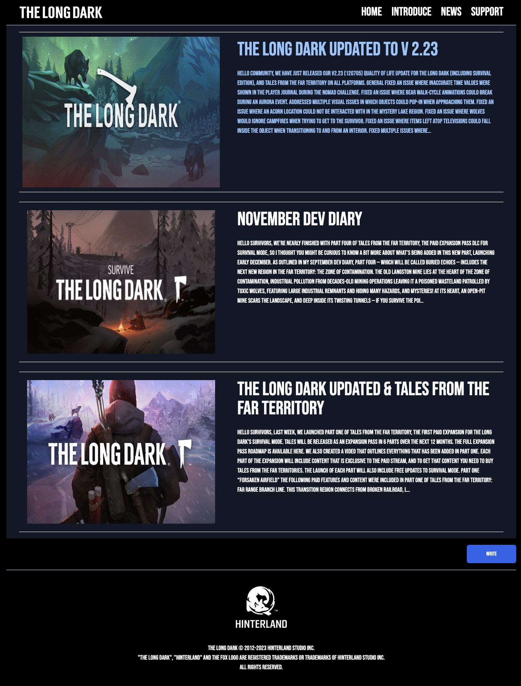
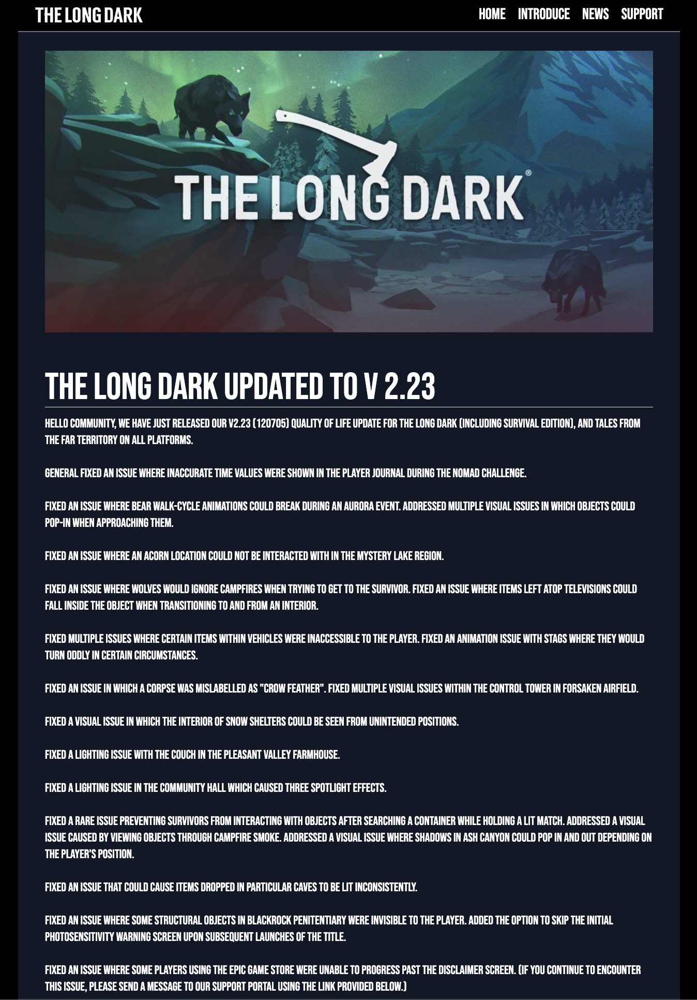
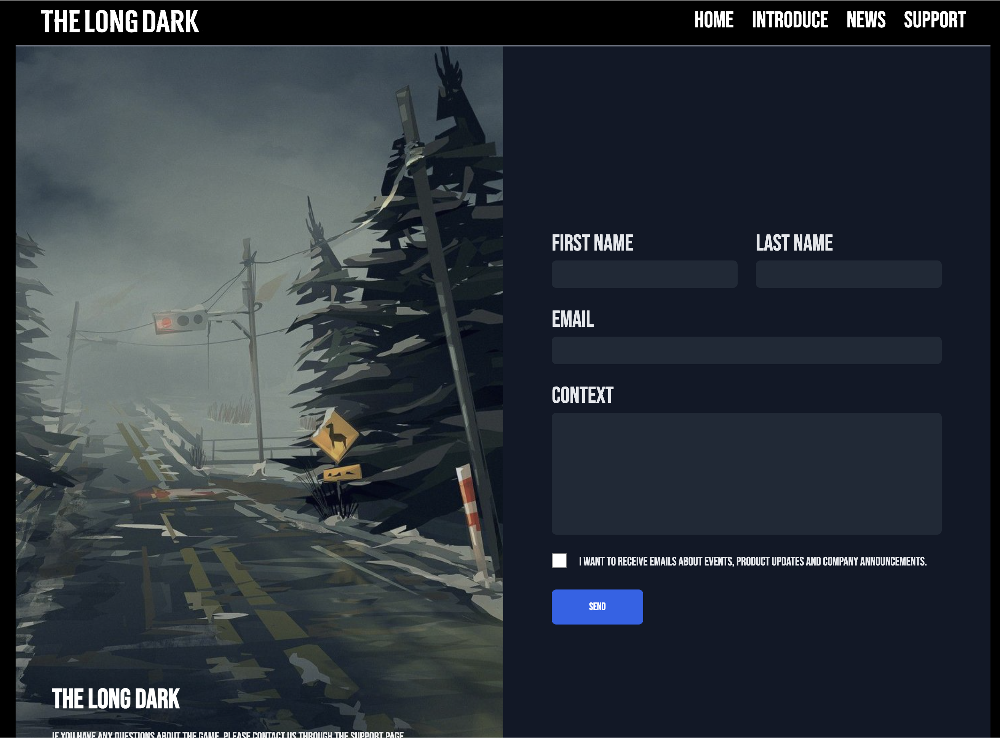

## Project_TheLongDark
> **Django, Tailwind을 이용하여 게임 소개하는 홈페이지를 만드는 프로젝트입니다.** <br>
> **개발기간 : 23.10.28 ~ 23.11.11**

## 배포주소
> **클라우드타입 배포** : https://port-0-project-thelongdark-12fhqa2lloisrec8.sel5.cloudtype.app/news/


## 기술스택


## 시작 가이드
해당 프로젝트를 실행시키기 위해서는 아래의 명령어를 실행합니다.

```
$ git clone https://github.com/JHeaon/Project_TheLongDark.git
$ pip install -r requirements.txt
$ python manage.py runserver
```
- .env : 실행전 환경변수 파일을 설정하셔야 합니다. 

```
# Django Secret Key
SECRET_KEY=

# DB
DB_NAME=
DB_USER=
DB_PASSWORD=
DB_HOST=
DB_PORT=

# Email
SENDEMAIL=
RECVEMAIL=
PASSWORD=
SMTPPORT=
```


## 화면구성






## 기능구현
News 페이지에서 글 작성시, 게시글을 생성하고 Support 페이지에서 문의 사항을 남길 시,
나의 이메일로 문의사항 발송되도록 기능을 구현하였습니다. 

- views.py
```
def write(request):
    if request.method == "POST":
        title = request.POST.get("title")
        context = request.POST.get("context")
        image = request.FILES.get('image')
        print(title, context, image)

        Post.objects.create(
            title=title,
            content=context,
            image=image,
        )

        return redirect("api:news")

    else:
        return render(request, "api/write.html")


def support(request):
    if request.method == "POST":

        first_name = request.POST.get("first_name")
        last_name = request.POST.get("last_name")
        email = request.POST.get("email")
        context = request.POST.get("context")

        Request.objects.create(
            first_name=first_name,
            last_name=last_name,
            email=email,
            context=context,
        )

        send_email(first_name + last_name, email, context)

        return render(request, "api/support.html")
```

- send_email.py
```
import os
import smtplib
from email.mime.text import MIMEText
from pathlib import Path

from dotenv import load_dotenv

BASE_DIR = Path(__file__).resolve().parent.parent
load_dotenv(BASE_DIR / '.env')

def send_email(name, email, context):
    sendEmail = os.getenv('SENDEMAIL')
    recvEmail = os.getenv('RECVEMAIL')
    password = os.getenv('PASSWORD')

    smtpName = "smtp.naver.com" #smtp 서버 주소
    smtpPort = os.getenv('SMTPPORT') #smtp 포트 번호

    context = f"이름 : {name}\n\n" + f"이메일 : {email}\n\n" + "내용 :" + context
    msg = MIMEText(context) #MIMEText(text , _charset = "utf8")

    msg['Subject'] = email
    msg['From'] = sendEmail
    msg['To'] = recvEmail

    s=smtplib.SMTP(smtpName , smtpPort)
    s.starttls() 
    s.login(sendEmail , password )
    s.sendmail(sendEmail, recvEmail, msg.as_string())
    s.close() 
```

실제 이메일 받을 때, 아래와 같이 받을 수 있습니다.


